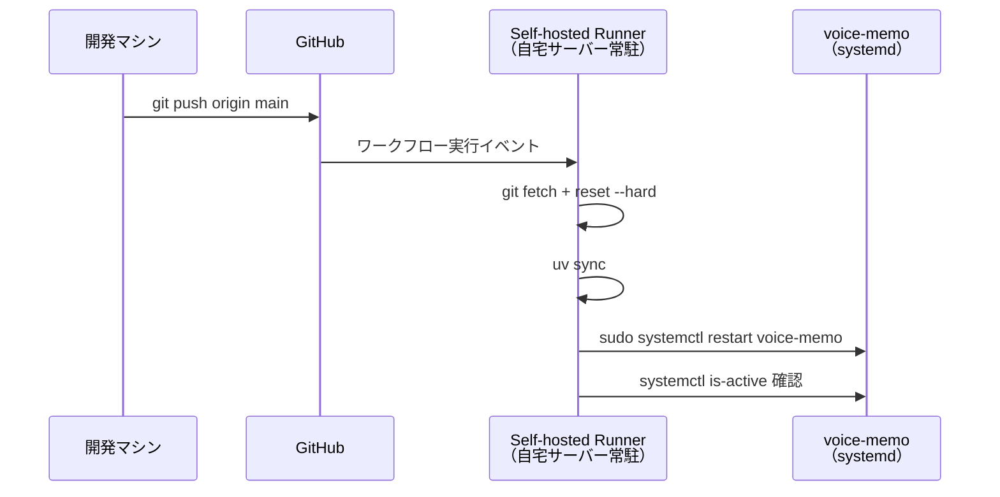

# 自宅サーバーへの自動デプロイを GitHub Actions で構築した

自宅サーバーで動かしている FastAPI アプリ（voice-memo）に、GitHub Actions の Self-hosted Runner を使った自動デプロイを整備した記録。`main` ブランチに push するだけでサーバーが更新される。

---

## やりたかったこと

これまでのデプロイは手作業だった。

```bash
ssh <username>@<server>
cd ~/dev/voice-memo
git pull origin main
uv sync
sudo systemctl restart voice-memo
```

小さい変更のたびにこれをやるのが面倒で、ミスも起きやすい。GitHub に push したタイミングで自動でサーバーが更新されるようにしたかった。

---

## 構成の選択肢

自動デプロイの実現方法はいくつかある。

| 方式 | 概要 | 採用理由・不採用理由 |
|---|---|---|
| **Self-hosted Runner** | サーバーに runner を常駐させ、GitHub Events を受信して実行 | ✅ SSH 不要・secrets 管理が楽 |
| SSH デプロイ | Actions から `ssh` コマンドでサーバーに入って実行 | CI に秘密鍵を預ける必要があり管理が面倒 |
| rsync / scp | ファイルを直接転送 | サービス再起動の制御がやりにくい |
| Docker + watchtower | イメージを push して自動更新 | 今回はコンテナ化していないためスコープ外 |

**Self-hosted Runner** が最もシンプルで、秘密鍵の管理も不要なため採用した。

---

## 全体の流れ



---

## ワークフローファイル

```yaml
name: Deploy

on:
  push:
    branches: [main]

jobs:
  deploy:
    runs-on: self-hosted
    env:
      APP_DIR: /home/<username>/dev/voice-memo

    steps:
      - name: Add uv to PATH
        run: echo "$HOME/.local/bin" >> $GITHUB_PATH

      - name: Pull latest code
        run: |
          git -C "$APP_DIR" fetch origin main
          git -C "$APP_DIR" reset --hard origin/main

      - name: Update dependencies
        working-directory: ${{ env.APP_DIR }}
        run: uv sync

      - name: Restart service
        run: sudo systemctl restart voice-memo

      - name: Verify service is running
        run: |
          sleep 2
          systemctl is-active --quiet voice-memo
```

### 設計のポイント

**`git pull` ではなく `git fetch + reset --hard` を使う**

`git pull` はローカルに未コミットの変更があるとコンフリクトで止まることがある。`reset --hard` にすることで常にリモートの状態に強制一致させ、デプロイが詰まらない。`.env` は `.gitignore` 対象の untracked ファイルなので `reset --hard` の影響を受けない。

**uv の PATH を明示的に通す**

Self-hosted Runner は clean な環境で実行されるため、`.bashrc` や `.profile` で設定した PATH が引き継がれない。`$GITHUB_PATH` に `~/.local/bin` を追加することで、後続ステップすべてに `uv` コマンドを通せる。

**verify ステップで再起動の成否を検出する**

`systemctl restart` は、サービスが起動に失敗しても exit 0 で終わることがある。再起動後に `systemctl is-active --quiet` を実行し、サービスが実際に動いているかを確認してワークフローの成否に反映させる。

---

## サーバー側のセットアップ

### 1. Self-hosted Runner のインストール

GitHub リポジトリの **Settings → Actions → Runners → New self-hosted runner** に表示されるコマンドをサーバーで実行する（トークン付きのため要ページ確認）。

### 2. systemd サービスとして常駐化

GitHub 公式の `svc.sh` を使えば systemd ユニットを自動生成してくれる。手書き不要。

```bash
cd ~/actions-runner
sudo ./svc.sh install
sudo ./svc.sh start
sudo systemctl status actions.runner.*  # 確認
```

### 3. sudoers の設定

runner ユーザーが `systemctl restart voice-memo` だけをパスワードなしで実行できるよう制限する。

```bash
sudo visudo -f /etc/sudoers.d/voice-memo-deploy
```

```
<username> ALL=(ALL) NOPASSWD: /usr/bin/systemctl restart voice-memo
```

`which systemctl` でパスを確認してから設定すること。

---

## ハマったこと：sudoers のユーザー名ミス

初回の実行でこのエラーが出た。

```
sudo: a terminal is required to read the password; either use the -S option to
read from standard input or configure an askpass helper
sudo: a password is required
```

sudoers に設定したユーザー名が間違ったままで、実際に runner を動かしているユーザーと一致していなかった。

```bash
# runner の実行ユーザーを確認
ps aux | grep actions-runner
# → <username>  3891185 ... /home/<username>/actions-runner/bin/Runner.Listener
```

`ps aux` でユーザーを確認するまで「sudoers は設定した」という思い込みで見落としていた。設定したつもりが効いていないパターンの典型。

---

## Cloudflare は変更不要だった

Cloudflare はサーバーのポートへの透過プロキシとして動いているだけなので、デプロイ手順に影響しない。`systemctl restart` の 2〜3 秒間は 502 になるが、Cloudflare のリトライ機能でほぼ吸収される。個人用途ではこれで十分。

---

## 壁打ちで得た気づき

**self-hosted runner のユーザーと sudoers のユーザーは一致させる**

runner のインストール時に「どのユーザーで動かすか」を意識していないと、後で権限設定でハマる。インストール・sudoers・アプリディレクトリのオーナー、この 3 つのユーザーをすべて揃えることが重要。

**runner の実行環境は .bashrc を読まない**

ローカルで動くコマンドが runner 上で `command not found` になるのは PATH が引き継がれないため。`$GITHUB_PATH` に追記する方法で解決できる。`.bashrc` を `source` しても runner 環境では効かない。

**`systemctl restart` の成功 ≠ サービスが起動している**

サービスの起動に失敗しても `restart` コマンド自体は成功扱いになることがある。CI を信頼できるものにするには、コマンドの終了コードではなく実際の状態を確認するステップが必要。
