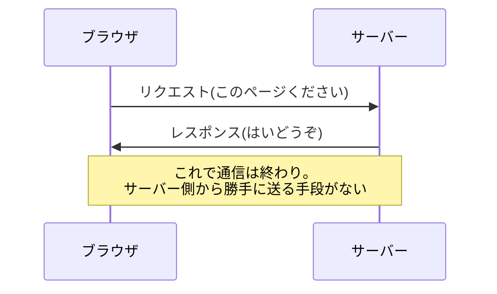
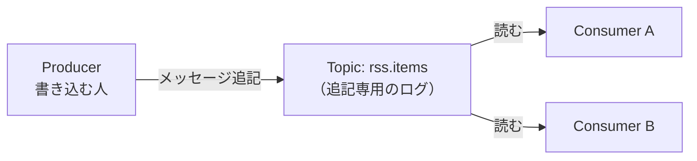
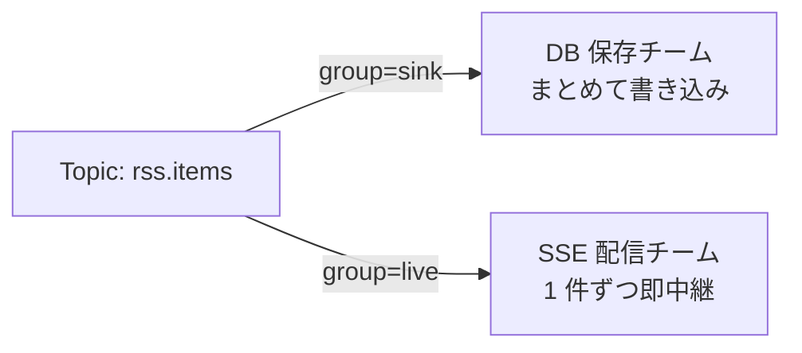
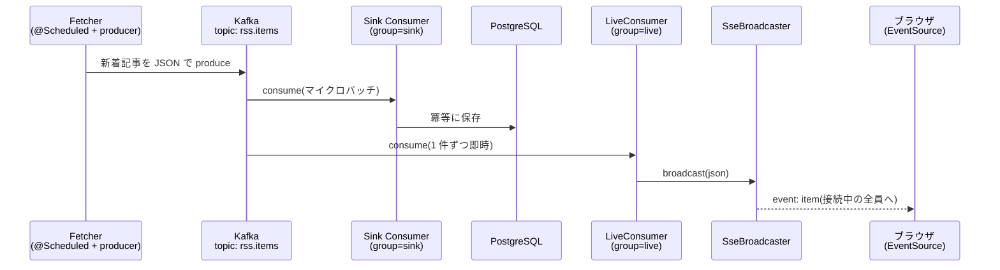

# Kafka + SSE でブラウザにリアルタイム配信する

RSS Watch(技術記事と求人の RSS を収集してクロスリンクするツール)で、「新着記事が届いた瞬間にブラウザの画面へ流れてくる」仕組みを Kafka + SSE(Server-Sent Events)で作った。この記事では、**そもそもサーバーからブラウザへ「push」するにはどんな方法があるのか**という一般論から始めて、SSE と Kafka の基礎を整理し、最後に RSS Watch での実装例を見ていく。

---

## そもそもの問題:HTTP は「サーバーから話しかけられない」

普通の Web の通信(HTTP)は、**必ずクライアント(ブラウザ)側からリクエストを送り、サーバーはそれに応答するだけ**という構造になっている。



つまり「サーバー側で新着記事が届いたから、ブラウザに教えてあげたい」と思っても、**サーバーからブラウザに話しかける口が標準の HTTP には存在しない**。これがリアルタイム更新を作るときの出発点になる課題。

### 解決策の選択肢

この課題への代表的なアプローチは 4 つある。

| 方式 | 仕組み | 向いている場面 |
|---|---|---|
| ポーリング | ブラウザが数秒おきに「新着ある?」と聞きに行く | 実装が最も簡単。即時性・効率は悪い |
| ロングポーリング | 「新着が来るまで返事を保留」するリクエストを繰り返す | ポーリングの改良版。接続の張り直しコストは残る |
| **SSE** | HTTP 接続を**開きっぱなし**にして、サーバーが一方通行で送り続ける | **サーバー→クライアントの通知だけ**でよい場合 |
| WebSocket | HTTP から専用プロトコルに切り替えて**双方向**通信 | チャットやゲームなど、クライアント→サーバーも頻繁な場合 |

RSS Watch の「新着記事を画面に流す」は**サーバー→ブラウザの一方通行で十分**(ブラウザから送るものがない)なので、SSE がちょうどいい。WebSocket はより強力だが、専用プロトコルになるぶんインフラ(プロキシや認証)との相性問題が増えるので、一方通行なら SSE のほうがシンプルに済む。

---

## SSE(Server-Sent Events)の基礎

SSE は「**ただの HTTP レスポンスを、終わらせずに延々と流し続ける**」技術。特別なプロトコルではなく、レスポンスの `Content-Type` が `text/event-stream` になっているだけの HTTP 通信である。

### ワイヤ上のフォーマット

サーバーが流すデータはこういうテキスト。`event:` がイベント名、`data:` が中身で、**空行 1 つがイベントの区切り**になる。

```
: connected

event: item
data: {"title":"Kotlin 2.2 リリース","link":"https://..."}

event: item
data: {"title":"Kafka 4.0 の新機能","link":"https://..."}
```

- `:` で始まる行は**コメント**(クライアントには通知されない。接続確認や keep-alive に使う)
- 仕様上は `id:`(再接続時に「どこまで受け取ったか」を伝える)や `retry:`(再接続間隔の指示)もある

### ブラウザ側は EventSource だけ

ブラウザには `EventSource` という専用 API が組み込まれていて、これを使うと上のテキストのパースを全部やってくれる。

```js
const source = new EventSource("/api/stream");

source.addEventListener("open", () => console.log("接続した"));
source.addEventListener("item", (event) => {
  const item = JSON.parse(event.data);  // data: の中身が届く
  // 画面に追加する処理
});
```

SSE の一番うれしい性質は、**切断されたらブラウザが勝手に再接続してくれる**こと。Wi-Fi が切れてもサーバーが再起動しても、`EventSource` が自動でリトライするので、クライアント側に再接続ロジックを書く必要がない(WebSocket だと自前実装になりがちな部分)。

---

## Kafka の基礎

次にサーバー側の話。Kafka は「**メッセージを一列に記録し続けるログ置き場**」で、書き込む側(producer)と読む側(consumer)を分離するための仕組み。

### 最低限の登場人物



| 用語 | 意味 |
|---|---|
| **Topic** | メッセージの入れ物。追記専用のログで、名前を付けて区別する(例: `rss.items`) |
| **Producer** | topic にメッセージを書き込む側 |
| **Consumer** | topic からメッセージを読む側 |
| **Consumer Group** | consumer のチーム名。**group が違えば、同じ topic をそれぞれ独立に最初から読める** |
| **Offset** | 「この group はどこまで読んだか」の栞。group ごとに独立して管理される |

### なぜキュー(順次処理)ではなく Kafka なのか

ここで重要なのが **consumer group** の性質。普通のジョブキュー(例: 1 つのタスクを 1 人が取って処理する方式)と違って、Kafka は**同じメッセージを複数のチームがそれぞれ読める**。



- 「DB に保存するチーム」と「ブラウザに流すチーム」が**同じ新着記事を別々のペースで処理**できる
- offset が group ごとに独立しているので、**片方が落ちてももう片方は動き続ける**。DB 側が詰まってもリアルタイム配信は止まらない

この「1 つの事実(新着記事が届いた)を、複数の用途に配る」形が、Kafka が pub/sub(出版‐購読)モデルと呼ばれる理由。

---

## RSS Watch での実装

ここからが具体例。RSS Watch の全体像はこうなっている。



SSE まわりは `live` モジュールとして 3 つのクラスに分かれている。役割ごとに見ていく。

### 1. エンドポイント:SseController

```kotlin
@RestController
class SseController(private val sseBroadcaster: SseBroadcaster) {

    @GetMapping("/api/stream", produces = [MediaType.TEXT_EVENT_STREAM_VALUE])
    fun stream(): SseEmitter = sseBroadcaster.register(SseEmitter(NO_TIMEOUT))

    companion object {
        /** SSE は長寿命接続のためサーバー側ではタイムアウトさせない(切断はクライアント任せ)。 */
        private const val NO_TIMEOUT = 0L
    }
}
```

Spring MVC では `SseEmitter` を返すだけで SSE エンドポイントになる。ポイントは 2 つ。

- `produces = TEXT_EVENT_STREAM_VALUE` で `Content-Type: text/event-stream` を宣言する
- **タイムアウトを `0L`(無制限)にする**。Spring のデフォルトだと一定時間でサーバー側から切られてしまう。SSE は「切れたらブラウザが再接続する」設計なので、サーバー側で寿命を管理せずクライアントに任せる

### 2. 接続管理と配信:SseBroadcaster

```kotlin
@Service
class SseBroadcaster {

    private val emitters = CopyOnWriteArrayList<SseEmitter>()

    /** クライアントを配信対象に登録し、切断時に自動で除去されるよう結線する。 */
    fun register(emitter: SseEmitter): SseEmitter {
        emitters += emitter
        emitter.onCompletion { emitters.remove(emitter) }
        emitter.onTimeout { emitters.remove(emitter) }
        emitter.onError { emitters.remove(emitter) }
        // 初期コメントを送ってレスポンスヘッダを即時 flush する
        // (これがないと最初の item まで EventSource の open が発火しない)
        try {
            emitter.send(SseEmitter.event().comment("connected"))
        } catch (e: Exception) {
            emitters.remove(emitter)
        }
        return emitter
    }

    /** 全クライアントへ item イベントを配信する。送信に失敗したクライアントは除去して続行する。 */
    fun broadcast(json: String) {
        for (emitter in emitters) {
            try {
                emitter.send(SseEmitter.event().name("item").data(json))
            } catch (e: Exception) {
                emitters.remove(emitter)
            }
        }
    }
}
```

「いま接続しているブラウザたち」をリストで持ち、新着が来たら全員に送る、というだけの構造。ただし細部に SSE 特有の考慮が詰まっている。

- **`CopyOnWriteArrayList` を使う**。登録・切断(Web のリクエストスレッド)と配信(Kafka の consumer スレッド)が別スレッドで同じリストを触るため、スレッドセーフなコレクションが必要
- **切断の後始末を 3 か所に結線する**。`onCompletion` / `onTimeout` / `onError` のどの経路で接続が終わってもリストから除去されるようにする。これを忘れると、切断済みの emitter がリストに溜まり続ける(メモリリーク)
- **接続直後にコメントを 1 発送る**。SSE のレスポンスヘッダは最初の書き込みまで flush されないため、何も送らないと**ブラウザ側の `open` イベントが最初の記事が届くまで発火しない**。中身のないコメント(`: connected`)を送ることで、接続確立を即座にブラウザへ伝えている
- **1 人の失敗で全員を巻き込まない**。`broadcast` は送信失敗したクライアントだけ除去して、残りへの配信を続行する

### 3. Kafka との接続:LiveConsumer

```kotlin
/**
 * topic `rss.items` を 1 件ずつ即時消費して SSE へ中継する(groupId = "live")。
 * DB には触らない。sink とは consumer group が独立しているため、
 * 片方の停止がもう片方に影響しない。
 */
@Component
class LiveConsumer(private val sseBroadcaster: SseBroadcaster) {

    @KafkaListener(
        id = "live",
        topics = ["\${rss-watch.topic}"],
        containerFactory = "liveKafkaListenerContainerFactory",
    )
    fun onMessage(message: String) {
        sseBroadcaster.broadcast(message)
    }
}
```

やっていることは「Kafka から受け取った JSON をそのまま `broadcast` に渡す」だけ。設計上のポイントは consumer の設定側にある。

- **consumer group を `live` として sink と分離**。前述のとおり、DB 保存(sink)とリアルタイム配信(live)が同じ topic を独立に読むことで、片方の障害がもう片方に波及しない
- **`auto.offset.reset = latest`**。live 用の consumer factory はオフセットのリセット位置を `latest` にしている。これにより、**アプリを再起動しても過去のメッセージを再配信せず、「接続後に届いた新着」だけ**が流れる。リアルタイム表示という用途では過去分の replay は不要(過去分は DB 経由のレポート API が担当)なので、この設定が用途に合っている。一方 sink 側は取りこぼしが許されないので、この設定は共有せず group ごとに分けている

### 4. ブラウザ側:EventSource

```js
function connectLive() {
  const source = new EventSource("/api/stream");

  source.addEventListener("open", () => {
    status.textContent = "● live";
  });
  source.addEventListener("error", () => {
    // EventSource は自動再接続する
    status.textContent = "再接続中…";
  });
  source.addEventListener("item", (event) => {
    const item = JSON.parse(event.data);
    list.prepend(itemLi(item));                       // 新着を先頭に追加
    while (list.children.length > 20) list.lastChild.remove();  // 20 件で打ち止め
  });
}
```

- `error` ハンドラでは表示を「再接続中…」に変えるだけで、**再接続処理は書いていない**。`EventSource` の自動再接続に全部任せる
- 受信した item は先頭に prepend し、20 件を超えた古いものは捨てる。「ライブ欄」はあくまで今の流れを見る場所で、履歴はレポート API 側で見る、という役割分担

---

## 運用で確認したこと

### リバースプロキシ越しでも SSE は通るか

RSS Watch は Cloudflare Tunnel + Cloudflare Access(認証)経由で公開しているが、SSE は**ただの HTTP** なので特別な設定なしにトンネルを通る。認証についても、`EventSource` はリクエスト時に **Cookie を自動送出する**ため、ブラウザで一度 Access の認証を済ませていれば `/api/stream` も追加の実装なしで認証付きアクセスになる。

「WebSocket ではなく SSE にしておくと、こういうプロキシ・認証まわりで素通りできることが多い」というのは選定理由の裏付けになった。

### テスト

- `SseBroadcasterTest`(単体): 登録・配信・切断クライアントの除去という振る舞いを検証
- `LiveConsumerIntegrationTest`(EmbeddedKafka 結合): Kafka に produce したメッセージが SSE クライアントまで届くことを、実際の Kafka(組み込み)をまたいで検証

---

## まとめ

- HTTP はサーバーから話しかけられない。**一方通行の通知なら SSE、双方向なら WebSocket** が定石で、今回は一方通行なので SSE を選んだ
- SSE は `text/event-stream` を流し続けるだけの HTTP。**ブラウザの `EventSource` が自動再接続までやってくれる**のが最大の利点
- Kafka の **consumer group** を分けると、同じメッセージを「DB 保存」と「リアルタイム配信」が独立に処理でき、片方の障害がもう片方に波及しない
- 実装の急所は一般論ではなく細部にある:**タイムアウト無効化・切断時の除去の結線・初回 flush 用のコメント送信・`auto.offset.reset=latest`** あたりが、動かして初めて必要性がわかるポイントだった
