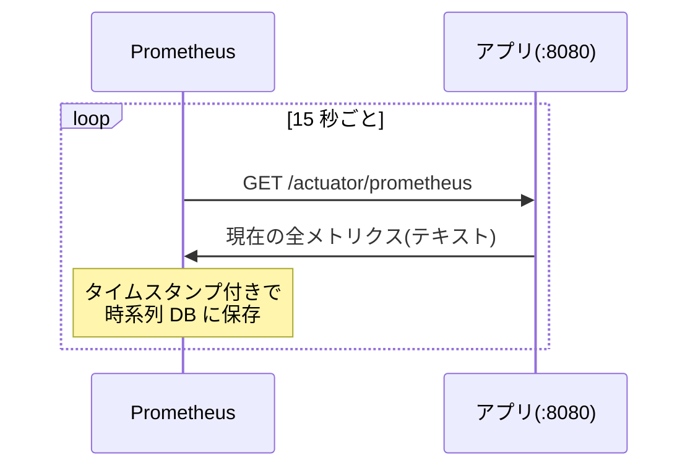

# Micrometer + Prometheus + Grafana でアプリの性能を見える化する

RSS Watch(技術記事と求人の RSS を収集してクロスリンクするツール)に、エンドポイントの応答時間などを Grafana で眺められる仕組みを入れた。動機は「記事が増えてきたら `/api/report` はどれくらい重くなるのか」を、改善の前後で数字で比較したかったこと。この記事では、**そもそもメトリクスとは何か・どう集めるのか**という一般論から始めて、Prometheus の仕組みとパーセンタイルの読み方を整理し、最後に RSS Watch で実際に集めているメトリクスと、ハマった点を見ていく。

---

## そもそもの問題:「遅い気がする」では改善できない

アプリを運用していると「最近ちょっと重い?」と感じる瞬間がある。しかしこの感覚には 2 つの問題がある。

1. **記録が残らない** — 感じた瞬間の状態は消えてしまい、1 ヶ月前と比べられない
2. **原因が分からない** — 遅いのは SQL なのか、GC なのか、単にアクセスが増えたのか、切り分ける材料がない

そこで「アプリの状態を数値として定期的に記録し続ける」仕組みが欲しくなる。この数値が**メトリクス**で、ログ(1 件ずつの出来事の記録)やトレース(1 リクエストの処理の追跡)と並ぶ、可観測性(observability)の基本要素のひとつ。

メトリクスの強みは**時系列で残る**こと。「改善デプロイの前の 1 週間」と「後の 1 週間」を同じグラフで見比べる、といった比較がそのままできる。

### 登場人物は 3 つ

| 役割 | 担当 | やること |
|---|---|---|
| 計測 | **Micrometer** | アプリ内部でリクエスト数・処理時間などを数える |
| 収集・保存 | **Prometheus** | 定期的に数値を取りに来て、時系列 DB に貯める |
| 可視化 | **Grafana** | 貯まった時系列をグラフ・ダッシュボードにする |

Micrometer は「メトリクス版の SLF4J」とよく言われる。SLF4J がログ出力先(Logback など)を差し替え可能にするのと同じで、Micrometer は計測 API を統一しつつ、出力先(Prometheus、Datadog、CloudWatch など)をレジストリの差し替えで選べるようにするファサード。Spring Boot は Actuator 経由で Micrometer と統合されていて、**依存を足すだけで HTTP・JVM・コネクションプールなどの主要メトリクスが勝手に集まる**。

---

## Prometheus の基礎

### pull 型:サーバーが「取りに来る」

直感的には「アプリが監視サーバーへ送る(push)」を想像するが、Prometheus は逆で、**Prometheus 側が定期的にアプリへ HTTP で取りに来る(pull / scrape)**。



アプリ側は「現在の値を返すエンドポイントを 1 個生やす」だけでよい。Spring Boot なら `spring-boot-starter-actuator` + `micrometer-registry-prometheus` を依存に足すと `/actuator/prometheus` が生え、こういうテキストを返すようになる。

```
# HELP http_server_requests_seconds Duration of HTTP server request handling
# TYPE http_server_requests_seconds histogram
http_server_requests_seconds_count{method="GET",status="200",uri="/api/report"} 42
http_server_requests_seconds_sum{method="GET",status="200",uri="/api/report"} 1.87
jvm_memory_used_bytes{area="heap",id="G1 Old Gen"} 5.1130368E7
```

`{...}` の部分は**ラベル**で、同じメトリクス名でも `uri` や `status` ごとに別の時系列として記録される。「エンドポイント別に見る」「5xx だけ数える」ができるのはこのラベルのおかげ。

pull 型の利点は、アプリが監視側の存在を知らなくてよい(送り先設定が不要)ことと、scrape の成否そのものが死活監視になること。Prometheus の `/targets` 画面で対象が DOWN になっていたら、アプリが落ちているか経路が塞がっているかがすぐ分かる。

### カウンタと histogram_quantile

メトリクスの読み方で最初につまずくのが「カウンタは増え続ける」こと。`http_server_requests_seconds_count` は起動からの**累積**リクエスト数なので、グラフにすると単調増加の右肩上がりにしかならない。知りたいのは「いま毎秒何件か」なので、PromQL の `rate()` で**単位時間あたりの増分**に変換して使う。

```promql
# 直近 5 分の平均リクエストレート(req/s)を uri ごとに
sum by (uri) (rate(http_server_requests_seconds_count[5m]))
```

もうひとつの急所が**パーセンタイル**。応答時間は平均で見ると実態を外す(大半が 30ms でも、たまに 3 秒かかるならユーザー体験は悪い)。そこで「95% のリクエストはこの時間以内に収まった」を表す p95 のような値を使う。

Micrometer に `management.metrics.distribution.percentiles-histogram.http.server.requests: true` を設定すると、応答時間が**バケット**(「0.1 秒以下が何件」「0.5 秒以下が何件」…の累積カウンタ群)として公開され、Prometheus 側で任意のパーセンタイルを計算できるようになる。

```promql
# /api/report の p95 応答時間
histogram_quantile(0.95,
  sum by (le) (rate(http_server_requests_seconds_bucket{uri="/api/report"}[5m])))
```

「アプリ側で p95 を計算して送る」のではなく「分布の材料(バケット)を送って集計は Prometheus でやる」のがポイント。あとから p50 でも p99 でも好きに出せるし、複数インスタンスの合算もできる。

---

## RSS Watch で集めているメトリクス

ここからが実例。RSS Watch のダッシュボードは 7 パネルで、**HTTP(主目的)→ リソース(原因切り分け)→ Kafka(取り込みパイプライン)**の 3 段構成にした。

### HTTP:主目的のパネル

**① エンドポイント別レイテンシ p50/p95/p99** — このダッシュボードの主役。`/api/report` の応答時間の推移を見る。p50 が「普段の速さ」、p95/p99 が「遅いときの遅さ」。記事数の増加とともに p95 がじわじわ伸びていれば、それが改善タスクの根拠になる。

```promql
histogram_quantile(0.95, sum by (le, uri) (
  rate(http_server_requests_seconds_bucket{uri!="/api/stream"}[5m])))
```

**② エンドポイント別リクエストレート** — ①と見比べて「遅くなったのは負荷が増えたからか、同じ負荷で遅くなったのか」を切り分ける。

**③ エラー率(5xx 比率)** — 全リクエストに占めるサーバーエラーの割合。改善デプロイ後にここが動いたら「速くなったけど壊れた」を検知できる。

```promql
sum(rate(http_server_requests_seconds_count{status=~"5.."}[5m]))
  / sum(rate(http_server_requests_seconds_count[5m])) or vector(0)
```

末尾の `or vector(0)` は「5xx が一度も起きていない期間は分子の時系列自体が存在しない → 結果が空になってグラフが欠ける」のを 0 で埋めるための慣例。

### リソース:遅さの原因を切り分けるパネル

**④ JVM ヒープ(used / max)** — used がノコギリ状に上下するのは GC の正常な動き。max に張り付いたまま下がらなくなったら、遅さの原因が GC 側にある可能性を示す。

**⑤ HikariCP コネクションプール(active / pending / max)** — DB コネクションの利用状況。**pending(空き待ち)が 0 を超えたら要注意**で、応答時間の悪化が「SQL が遅い」ではなく「コネクション待ち」である状態。`/api/report` が遅いときに SQL 側か JSON 組み立て側かを一次切り分けできる。

### Kafka:取り込みパイプラインのパネル

**⑥⑦ Kafka リスナーの処理レートと平均処理時間** — RSS 記事を消費する 2 つのリスナー(`sink-0` = PostgreSQL 保存、`live-0` = SSE 配信)の処理状況。フィード取得周期(15 分)ごとに山ができるのが正常。sink の処理時間が伸びてきたら、取り込み側(INSERT)が重くなっているサイン。

```promql
# 平均処理時間 = 合計時間の増分 ÷ 件数の増分
sum by (name) (rate(spring_kafka_listener_seconds_sum[5m]))
  / sum by (name) (rate(spring_kafka_listener_seconds_count[5m]))
```

---

## ハマった点・設計判断

### SSE エンドポイントはレイテンシから除外する

`http.server.requests` はリクエスト完了時に所要時間を記録する。ところが SSE の `/api/stream` は**接続を開きっぱなしにする**エンドポイントなので、接続が閉じた瞬間に「接続していた時間(数分〜数時間)」がレイテンシとして記録されてしまう。放っておくとレイテンシパネルが SSE の外れ値で埋まって主役の `/api/report` が読めなくなるため、レイテンシ系クエリはすべて `uri!="/api/stream"` で除外した。

### `kafka_consumer_*` は「自動で載る」とは限らない

Spring Boot は Kafka の consumer メトリクス(`kafka_consumer_*`)も自動計装する——**ただし自動構成の `ConsumerFactory` Bean を使っている場合に限る**。RSS Watch はコンテナファクトリ内で `DefaultKafkaConsumerFactory` を自前 new しているため、Boot のカスタマイザ(`MicrometerConsumerListener` を付ける仕掛け)が届かず、このメトリクスは一切出ない。

当初の設計はここを見落としていて、レビューで「そのパネルは恒久的に無データになる」と指摘されて発覚した。代わりに採用したのが **spring-kafka のリスナーコンテナが自前で登録するタイマー** `spring.kafka.listener`(Prometheus 名 `spring_kafka_listener_seconds_*`)。こちらはコンテナファクトリが `@Bean` でありさえすれば、consumer factory を自前 new していても登録される。「フレームワークの自動計装は、自分のコードが自動構成に乗っているときだけ働く」という教訓。

なお `name` ラベルの実値は `sink` ではなく `sink-0`。Concurrent コンテナの**子コンテナ名**(`@KafkaListener` の id + 連番)が入るためで、知らないとダッシュボードで一瞬戸惑う。

### テストでは metrics export が無効化されている

`/actuator/prometheus` が 200 を返すことを `@SpringBootTest` で検証しようとすると、なぜか 404 になる。Spring Boot はテストの起動を軽くするため、**`@SpringBootTest` ではメトリクスのエクスポートを自動で無効化する**からで、テストクラスに `@AutoConfigureObservability` を付けると本番同等に有効化される。条件評価レポート(ConditionEvaluationReport)を眺めてようやく原因に辿り着いた。

### 公開範囲は最小限に

Actuator には環境変数ダンプ(`/actuator/env`)など運用情報がそのまま見えるエンドポイントもあるため、expose は `health,prometheus` の 2 つだけの allowlist にした。また RSS Watch には Cloudflare Access の JWT を全リクエストで検証する任意ハードニングがあり、有効化するとローカルの Prometheus からの scrape も 401 になってしまう。そこでフィルタ側に「`/actuator/health` と `/actuator/prometheus` への**完全一致**のみ検証をスキップ」する除外を入れた。前方一致ではなく完全一致にしたのは、将来 expose を広げたときに無認証範囲が黙って広がらないようにするため(除外が外れる方向にしか壊れない = fail-closed)。

---

## まとめ

- メトリクスは「時系列で残る数値」。感覚ではなくグラフで前後比較できるのが最大の価値
- Prometheus は **pull 型**。アプリは `/actuator/prometheus` を生やすだけで、収集・保存・集計は Prometheus 側の仕事
- 応答時間は平均ではなく **p95/p99**で見る。バケットを公開して `histogram_quantile` で集計する分業がうまい仕組み
- ダッシュボードは「主目的(HTTP)→ 原因切り分け(JVM/DB)→ パイプライン(Kafka)」のように、**見る順番を決めて**組むと迷わない
- 自動計装は万能ではない。**自分のコードが自動構成から外れている箇所**(自前 new した factory、開きっぱなしの SSE)では、何がどう計測されるかを実物で確かめること
