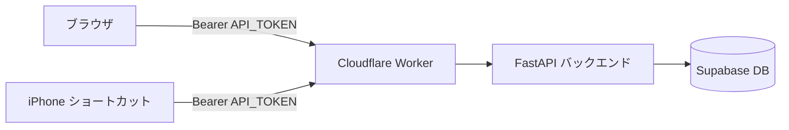
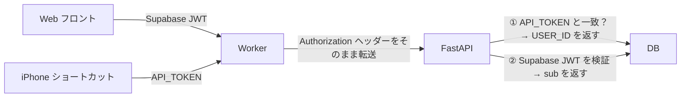

# PWA に Supabase Auth でログイン機能を追加した

音声メモ管理 PWA（Cloudflare Pages + FastAPI）に Google OAuth ログインを追加した記録。
個人用アプリだが URL さえわかれば誰でもアクセスできる状態だったため、認証を実装した。

---

## 課題：誰でも見えるアプリ

もともとの構成は以下のようなものだった。



フロントエンドに認証画面がなく、URL を知っていれば誰でもタスクを閲覧・操作できた。
さらに `VITE_API_TOKEN`（静的トークン）がビルド時に JS バンドルに埋め込まれるため、
DevTools でソースを見れば誰でもトークンを取り出せる状態だった。

---

## 設計：2種類の認証を両立させる

このアプリには2つのクライアントがある。

| クライアント | 認証方式 |
|---|---|
| Web フロントエンド（PWA） | Supabase Auth（Google OAuth）の JWT |
| iPhone ショートカット | 静的 `API_TOKEN`（OAuth の範囲外） |

iPhone ショートカットはブラウザを持たないため OAuth を使えない。
そのため**静的トークンと Supabase JWT の両方を受け付ける**設計にした。



---

## バックエンドの変更

`verify_token()` を2方式対応にした。API_TOKEN を先にチェックし、一致しなければ Supabase JWT として検証する。

```python
def verify_token(credentials) -> str:
    token = credentials.credentials

    # ① iPhone ショートカット用：静的トークン
    if secrets.compare_digest(token, os.environ["API_TOKEN"]):
        return os.environ["USER_ID"]

    # ② Web フロント用：Supabase JWT（ES256）
    header = jwt.get_unverified_header(token)
    public_key = _jwks_keys.get(header["kid"])
    payload = jwt.decode(token, public_key, algorithms=["ES256"], audience="authenticated")
    return payload["sub"]
```

### ハマりポイント：Supabase は ES256 を使う

最初は HS256 + Legacy JWT Secret で実装したが、401 エラーが続いた。
JWT のヘッダーをデコードすると `"alg": "ES256"` だった。

新しい Supabase プロジェクトは**楕円曲線署名（ES256）**を使っており、
Legacy JWT Secret（HS256 用）では検証できない。

対策として JWKS エンドポイントから公開鍵を取得・キャッシュする方式に変更した。

```python
# 起動時に公開鍵をキャッシュ
jwks_url = f"{SUPABASE_URL}/auth/v1/.well-known/jwks.json"
with urllib.request.urlopen(jwks_url) as res:
    jwks = json.loads(res.read())
_jwks_keys = {
    key["kid"]: jwt.algorithms.ECAlgorithm.from_jwk(key)
    for key in jwks["keys"]
}
```

---

## フロントエンドの変更

### 追加ファイル

| ファイル | 役割 |
|---|---|
| `src/lib/supabase.ts` | Supabase クライアント初期化 |
| `src/pages/LoginPage.tsx` | Google ログインボタン画面 |
| `src/components/ProtectedRoute.tsx` | 未ログイン時に `/login` へリダイレクト |

### API 呼び出しの変更

静的トークンの代わりに Supabase セッションの JWT を Bearer トークンとして送る。

```typescript
// Before
const TOKEN = import.meta.env.VITE_API_TOKEN ?? '';
headers['Authorization'] = `Bearer ${TOKEN}`;

// After
const { data } = await supabase.auth.getSession();
const token = data.session?.access_token ?? '';
headers['Authorization'] = `Bearer ${token}`;
```

---

## CORS まわりのトラブル

### Cloudflare Worker が Authorization ヘッダーを許可していなかった

Worker の CORS 設定に `Authorization` が含まれていなかった。

```js
// Before（不足）
"Access-Control-Allow-Headers": "Content-Type"

// After（修正）
"Access-Control-Allow-Headers": "Content-Type, Authorization"
```

### Worker が API_TOKEN で上書きしていた

Worker がリクエストを転送する際、フロントから来た Authorization ヘッダーを
`env.API_TOKEN` で上書きしていた。Supabase JWT が届かない原因だった。

```js
// Before（上書き）
"Authorization": `Bearer ${env.API_TOKEN}`

// After（転送）
"Authorization": request.headers.get("Authorization") ?? ""
```

### バックエンドの FRONTEND_ORIGIN が未設定

FastAPI の CORS ミドルウェアは `FRONTEND_ORIGIN` 環境変数で許可オリジンを追加する設計になっていた。
本番サーバーにこの変数が設定されていなかったため、Cloudflare Pages のドメインが許可されていなかった。

```python
_cors_origins = ["http://localhost:5173"]
if _frontend_origin := os.environ.get("FRONTEND_ORIGIN"):
    _cors_origins.extend(...)  # ← これが動いていなかった
```

---

## 学び

- **Supabase は ES256**：新しいプロジェクトは Legacy JWT Secret（HS256）ではなく ES256 を使う。JWT のヘッダーをデコードしてアルゴリズムを確認するのが先決
- **JWKS エンドポイント**：公開鍵は `{SUPABASE_URL}/auth/v1/.well-known/jwks.json` から取得できる。`kid` で鍵を選択して検証する
- **CORS のデバッグは curl で**：ブラウザのエラーメッセージだけでは原因が特定しにくい。`curl -X OPTIONS` でプリフライトレスポンスを直接確認すると速い
- **Worker はプロキシの責務に徹する**：Worker が Authorization を独自に付与するのではなく、フロントから来たヘッダーをそのまま転送する設計が正しい
