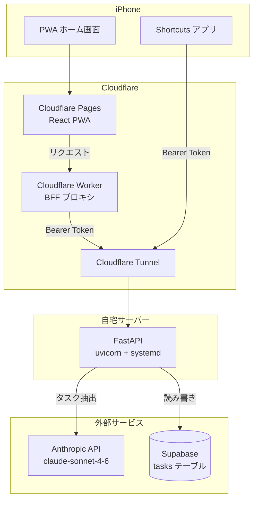
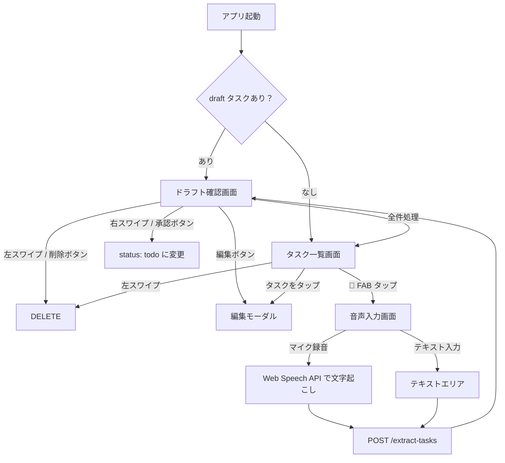
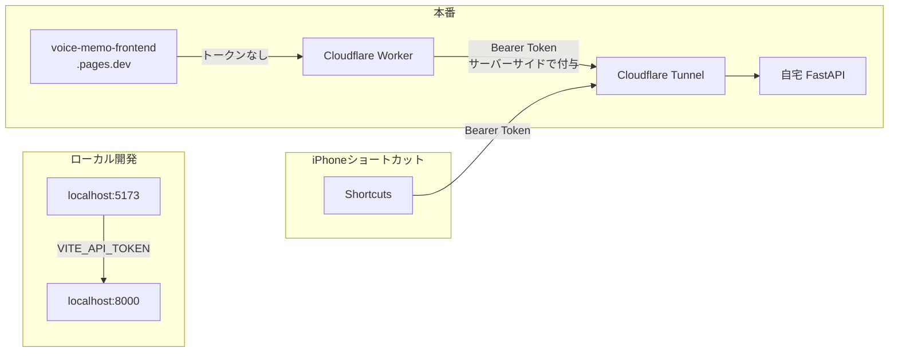
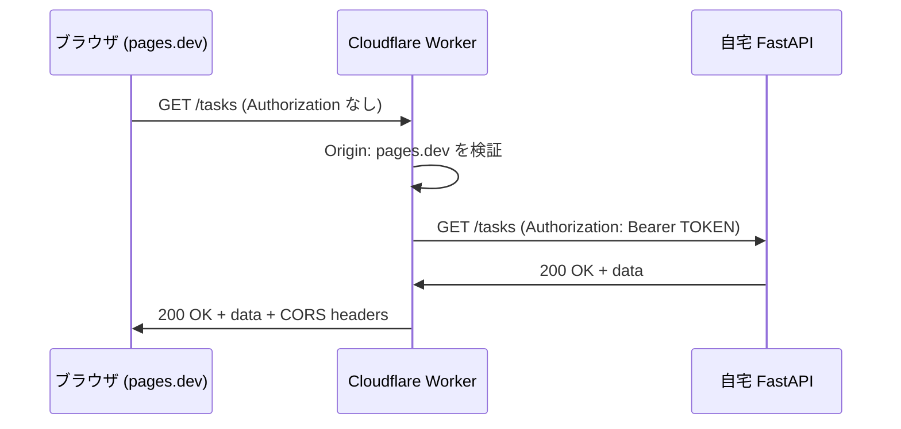

# 音声メモ → タスク管理 PWA を作った

音声メモの書き起こしから Claude AI でタスクを自動抽出し、スマホのホーム画面から使える PWA として仕上げるまでの記録。FastAPI + React + Cloudflare の構成でゼロから作った。

---

## システム構成



---

## バックエンド構成

**FastAPI（Python）+ Supabase + Anthropic API** の構成。全ロジックを `main.py` 1ファイルに収めるシンプルな設計。

### エンドポイント

| エンドポイント | 用途 |
|---|---|
| `POST /extract-tasks` | 音声メモのテキストから Claude でタスクを抽出 → Supabase に `draft` で保存 |
| `GET /tasks?status=` | タスク一覧取得（status フィルタ） |
| `PATCH /tasks/{id}` | タスク更新（承認・編集・完了） |
| `DELETE /tasks/{id}` | タスク削除 |
| `GET /health` | 死活確認 |

### タスク抽出の仕組み

```
音声メモのテキスト
    ↓
Claude API にプロンプトで投げる（今日の日付付き）
    ↓
JSON 配列として返ってくる（title / priority / due_date 等）
    ↓
Supabase の tasks テーブルに status=draft で INSERT
```

Claude のレスポンスがコードブロックで包まれることがあるため、マークダウン除去の処理を入れている。

### 認証

`HTTPBearer` でトークンを受け取り、`secrets.compare_digest()` でタイミング攻撃対策をして比較する。`/health` のみ認証不要。

### Supabase のスキーマ

```sql
create table tasks (
  id        uuid primary key default gen_random_uuid(),
  user_id   uuid not null references auth.users(id),
  title     text not null,
  body      text,
  status    text check (status in ('draft', 'todo', 'done')) default 'draft',
  priority  integer check (priority between 1 and 4) default 3,
  due_date  date,
  source    text check (source in ('voice', 'manual')) default 'manual',
  created_at timestamptz default now(),
  updated_at timestamptz default now()
);
```

`service_role` キーで Supabase クライアントを生成し RLS をバイパス。`user_id` フィルタはアプリ側（`USER_ID` 環境変数）で担保。

---

## フロントエンド構成

**Vite + React + TypeScript + Tailwind CSS v4** の構成。react-swipeable でスワイプジェスチャーを実装し、vite-plugin-pwa で PWA 化した。

### 画面フロー



### ドラフト確認のスワイプカード

音声メモから抽出されたタスクは `draft` 状態で溜まる。アプリ起動時に draft があれば確認画面を先出しして、1件ずつカード形式でレビューさせる設計にした。

- **右スワイプ** → `PATCH status: todo`（タスクとして追加）
- **左スワイプ** → `DELETE`（捨てる）
- スワイプ量に応じて緑/赤のオーバーレイが透けて見える視覚フィードバック付き

### PWA の iOS 対応

Safari から「ホーム画面に追加」するだけでネイティブアプリ風に使えるように以下を設定した：

```html
<meta name="apple-mobile-web-app-capable" content="yes" />
<meta name="apple-mobile-web-app-status-bar-style" content="black-translucent" />
<meta name="apple-mobile-web-app-title" content="VoiceTasks" />
<link rel="apple-touch-icon" href="/apple-touch-icon.png" />
<meta name="viewport" content="width=device-width, initial-scale=1.0, viewport-fit=cover" />
```

`viewport-fit=cover` + `env(safe-area-inset-*)` で Dynamic Island / ノッチ対応も入れた。

---

## デプロイ構成



### 自宅サーバー公開: Cloudflare Tunnel

ルーターのポート開放・固定 IP なしで自宅サーバーを HTTPS 公開できる。`cloudflared` をインストールして systemd サービスとして登録するだけ。

```bash
cloudflared tunnel create voice-memo-api
cloudflared tunnel route dns voice-memo-api api.yourdomain.com
cloudflared service install
```

### フロントエンド: Cloudflare Pages

GitHub リポジトリと連携して、`main` ブランチへの push で自動ビルド＆デプロイ。ビルド設定は `npm run build` / 出力先 `dist` だけ。

---

## セキュリティ設計: Cloudflare Worker BFF

最初は `VITE_API_TOKEN` を Cloudflare Pages の環境変数に設定していたが、`VITE_` プレフィックスの変数はビルド時に JS バンドルへ埋め込まれるため、ブラウザの DevTools で誰でも読める状態だった。

### 問題

```
VITE_API_TOKEN=abc123
    ↓ ビルド時に埋め込まれる
dist/assets/index-xxx.js: ...Bearer abc123...
    ↓
DevTools で丸見え → /extract-tasks を叩かれると Anthropic API 料金が発生
```

### 解決: Worker をプロキシとして挟む



Worker は `API_TOKEN` をサーバーサイドの秘密環境変数として持ち、ブラウザには渡さない。JS バンドルに認証情報が一切含まれなくなる。

Worker の Origin チェック（`pages.dev` 以外は 403）で、ブラウザ経由の不正利用も防げる。

```bash
# トークンをコードに書かずに登録
npx wrangler secret put API_TOKEN
```

### 結果の確認方法

```bash
# バンドルにトークンが含まれていないか確認
curl -s https://voice-memo-frontend.pages.dev/assets/index-xxx.js \
  | grep -c "YOUR_TOKEN" && echo "漏れあり" || echo "漏れなし"
```

---

## 壁打ちで得た気づき

**`VITE_` 変数はクライアントサイドに丸見え**

「環境変数 = 秘密」と思いがちだが、Vite の `VITE_` プレフィックスはビルド時に静的に置換されてバンドルに埋め込まれる。バックエンドの環境変数とは全く別物。フロントエンドに秘密を持たせてはいけない。

**BFF（Backend For Frontend）パターンの実用性**

Cloudflare Worker が軽量な BFF として機能する。認証情報の隠蔽・CORS 制御・Origin 検証を数十行で実現できる。インフラのオーバーヘッドがほぼゼロで導入できるのが強み。

**個人用アプリのセキュリティの考え方**

完璧なセキュリティより「リスクと対策のバランス」が重要。今回の構成では：
- トークンが漏れても `user_id` フィルタでデータは守られる
- Worker で extract-tasks へのアクセスをブラウザ経由に限定できる
- iPhone Shortcuts のトークンは端末内に閉じている

**PWA と通知**

iOS の PWA は Web Push 通知が制限されていて、ネイティブアプリのような通知体験は難しい。今回はひとまず通知なしで割り切り、Shortcuts でのメモ作成フローに集中した。

---

## リポジトリ

| リポジトリ | 内容 |
|---|---|
| [voice-memo](https://github.com/rockyh0825/voice-memo) | FastAPI バックエンド |
| [voice-memo-frontend](https://github.com/rockyh0825/voice-memo-frontend) | React PWA フロントエンド |
