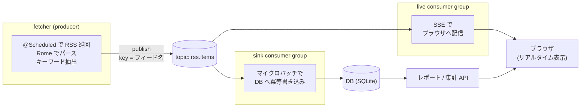

# RSS Watch システム設計

RSS Watch の目的とシステム構成(Kotlin + Spring Boot + Kafka)をまとめる。個々の意思決定の背景は [アーキテクチャ決定ログ](architecture-decisions.md) を参照。

---

## 目的

1. **技術情報の収集**: 技術系フィード(はてブ IT・Zenn・Qiita・Publickey・Hacker News)を巡回して新着を蓄積する
2. **就活情報との接続**: 求人系フィード(HN Jobs・Who is hiring・We Work Remotely・Remote OK)も同時に収集する
3. **クロスリンク(目玉機能)**: 記事・求人のテキストから技術キーワードを抽出し、「求人で言及回数の多い技術」ランキングと「その技術についての技術記事」を並べて表示する。市場で求められている技術と学習リソースが一画面でつながる

副次的な目的として、このプロジェクト自体を **Kafka・Kotlin・Spring Boot の学習題材**にする。

---

## システム構成

自宅サーバー上で、取得と表示の間に Kafka を挟んだイベント駆動構成にする。

### 役割分担

| コンポーネント | 役割 | 消費戦略 |
|---|---|---|
| fetcher | RSS 取得 → キーワード付与 → `rss.items` へ publish | -(producer) |
| sink consumer | DB への蓄積。集計・レポートの元データを作る | マイクロバッチ。遅延より「確実に全件」優先 |
| live consumer | SSE でブラウザへ新着をリアルタイム配信 | 1 件ずつ即時。低遅延優先 |

同じ topic を **2 つの consumer group が独立したオフセットで読む**のがこの構成の核。sink を止めても live は流れ続け、sink を再起動すると溜まった分を catch-up する(→ [決定ログ: 1 topic + 2 consumer group](architecture-decisions.md#1-topic-2-consumer-group))。

### 主要な処理の設計

- **フィード定義**: `category = "tech" | "jobs"` の 2 分類で設定ファイルに持つ。行を足すだけで増やせる
- **重複排除**: RSS エントリの `guid` を UNIQUE キーにした冪等書き込み(`INSERT OR IGNORE` 相当)。同じメッセージが再配信されても DB は重複しない(at-least-once 配信との組み合わせの要)
- **キーワード抽出**: 「正規化名 + エイリアス」の辞書(約 60 分類)+ 正規表現で、タイトル + 概要から抽出する。publish 前に fetcher 側で済ませる
- **レポート / 集計 API**: 直近 N 日を対象に、①求人で言及された技術 × 関連記事のクロスセクション ②技術記事一覧 ③求人一覧 を返す

### 技術スタック

| 項目 | 技術 |
|---|---|
| 言語 / FW | Kotlin + Spring Boot(spring-kafka, spring-boot-starter-web) |
| RSS パース | Rome |
| メッセージング | Apache Kafka(KRaft モード、シングルブローカー) |
| 運用ツール | kafka-ui(ブラウザで topic の中身を確認) |
| DB | SQLite(将来 PostgreSQL に差し替え可能な構造にする) |
| 実行基盤 | 自宅サーバー + Docker Compose |

### 定期実行

fetcher は Spring の `@Scheduled` で常駐プロセス内から定期巡回する。外部スケジューラ(cron 等)に依存せず、デプロイ物が 1 つにまとまる。プロセス停止時の巡回停止は systemd の自動再起動で対処する。

---

## 制約・既知の課題

- **日本語の求人 RSS はほぼ存在しない**。求人系フィードは当面英語圏中心。日本の求人サイトで RSS を見つけたら設定に追加する
- キーワード辞書はメンテが必要(新しい技術は手で足す)。ただしこれは意図した設計(→ [決定ログ: 辞書ベース抽出](architecture-decisions.md))
